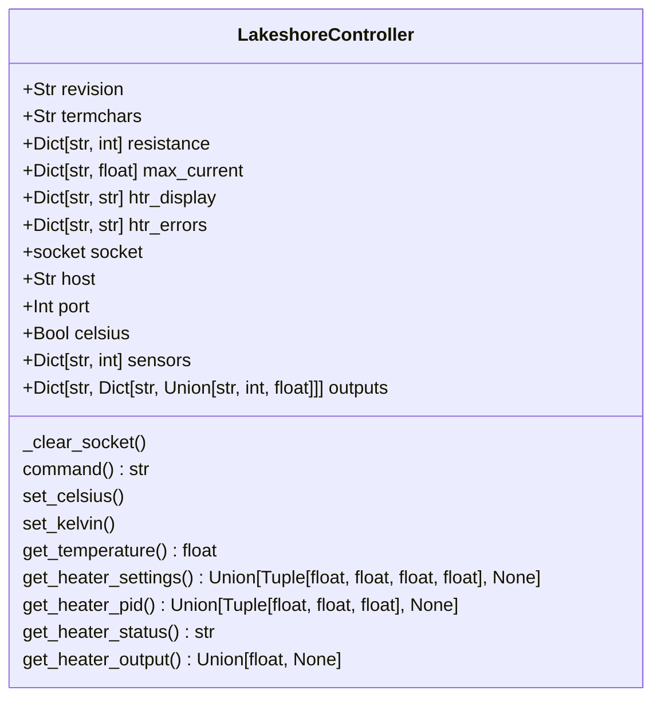

# lakeshore_controller

Low-level Python modules to send commands to Lakeshore 224 or 336 controllers.

## Currently Supported Models
- 224 & 336 - lakeshore.py

## Features
- Connect to Lakeshore controllers over Ethernet
- Query sensor values
- For model 336, query status and parameters of heaters

## Requirements

- Install base class from https://github.com/COO-Utilities/hardware_device_base

## Installation

```bash
pip install .
```

## Usage

```python
import lakeshore

controller = lakeshore.LakeshoreController()    # defaults to 336
controller.connect('192.168.29.104', 7777)

# Initialize controller
controller.initialize(celsius=False)    # print temperatures in Kelvin

# Print heater 1 status
print(controller.get_heater_status('1'))

# Print sensor A temperature
print(controller.get_temperature('a'))

# Print heater 2 output
print(controller.get_heater_output('2'), controller.outputs['2']['htr_display'])

# For a comprehensive list of classes and methods, use the help function
help(lakeshore)

```

## 🧪 Testing
Unit tests are located in `tests/` directory.

To run all tests from the project root:

```bash
python -m pytest
```

## Class Diagram

Below is a class diagram of the added methods and attributes for the lakeshore.
See the README for the hardware_device_base module for the inherited methods and
attributes.

